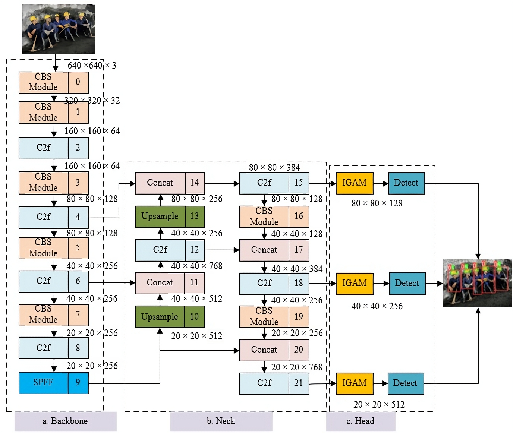
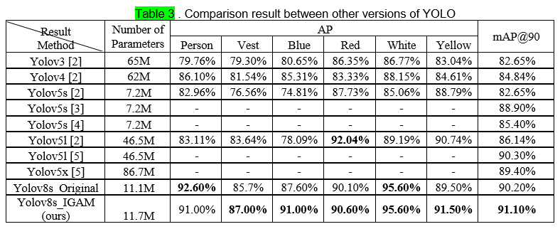

# Pedestrian Detection Using YOLO with Improved Attention Module (Status: Sumbmission)

## Introduction

This paper presents an improved Yolov8 's framework for PPE detection. We propose I-GAM attention modules incorporated with Yolov8 architecture to highlight significant information.  Additonally, the modified Improved Global Attention Mechanism (I-GAM) was inserted in the head of Yolo network to enhance feature representation

## Proposed Yolov8 's Architecture

## Proposed I-GAM Architecture with fine-tunning

## Color Helmet and Vest (CHV)  Dataset

In our experiment, we used dataset **Color Helmet and Vest (CHV)**, which included 170 images with 345 labeled pedestrians

The dataset is open for free use, raw data download at (https://github.com/ZijianWang-ZW/PPE_detection) or data which already processed (https://universe.roboflow.com/hienlongairesearch/chv_dataset_train_officially ). 

## Results

- **YOLO v8 outperform when compare with others method 's research.**

 

Figure: Comparision Results.

## Citation
`
@INPROCEEDINGS{10473662,
  author={Vinh, Truong Quang and Long, Pham Hien},

`

Or
	
`T. Q. Vinh and P. H. Long, `

